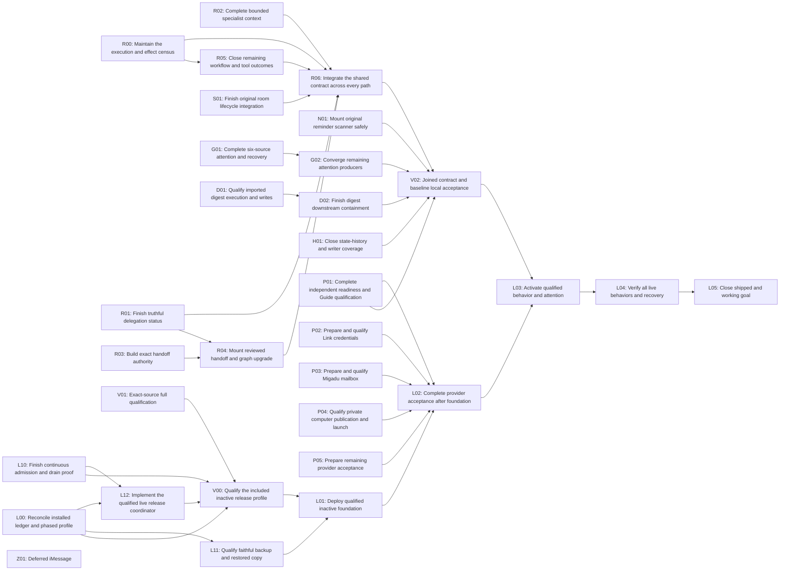

# SupraOS Agent Plan Checklist

Checkpoint: 2026-10-06T01:56:57+00:00. Release shipped 2026-10-05: #6168 merged (main 8e028e3964) and live; all 19 release packets installed and proven; follow-ups #6208 N1, #6217 C, #6215 N3, #6210 I, #6209 batch 1 merged; live 0d25a537b health 200 (22:36 UTC). Agent Run OFF for everyone (flags and allowlist not set). Open: #6214 N6, #6218 G, #6216 H. Accepted 5/62.

[Detailed handoff](https://github.com/jtobkin/supraos-agent-completion-handoff/blob/main/SupraOS-Universal-Agent-Completion-Handoff.md) · [Execution procedure](https://github.com/jtobkin/supraos-agent-completion-handoff/blob/main/Faster-Verified-SupraOS-Delivery.md) · [Private engineering plan](https://github.com/jtobkin/suprafx-platform/blob/codex/agent-run-execution-20260928/docs/agent-run/EXECUTION-PLAN-20261001.md)

**5 of 62 tasks accepted (8.1%); 56 pending (90.3%); 1 deliberately dropped (1.6%).** This is task acceptance, not a percentage of code or effort. Full Agent Run: release shipped with Agent Run off; not activated; full project not complete; global attention cutover: 0; restoreVerified: false.

## Current state — October 6, 2026 ~02:00 UTC

**Shipped (merged via merge-if-green, deployed):**

- #6168 Agent Run release candidate → 8e028e3964
- #6208 N1 no Agent Run switch for owners who cannot use it; status card for those who can → 6f2888485c
- #6217 lane C friend share + shop-call preview → 3978eb7032
- #6215 N3 read-only live-check script + LIVE-CHECK.md → fb470c1e8a
- #6210 lane I release hygiene → 7092987f1b
- #6209 Phase-2 batch 1 (A, B, D, E + email-chase Telegram notice held to allowlisted owners) → ba4b86109b
- #6194 phone-call hotfix (earlier; live proof owed)

**Database:** all 19 release packets installed and proven (Phase A 16 on 2026-10-05 06:13–06:25 UTC; Phase S 3 at 13:21 UTC; ledger readback 19/19).

**Live:** 0d25a537b, health 200 (2026-10-05 22:36 UTC). Agent Run is OFF for everyone — the three variables are not set.

**Open PRs:**

- #6214 N6 see your agent's loose ends — both box-ci statuses success (batch with #6209); independent review SAFE TO MERGE; not merged only because the merge watcher was stopped by a session restart
- #6218 G marks wiring — independent review SAFE TO MERGE; box-ci error "the PR conflicts with main" (stacked on #6209's squash-merged branch)
- #6216 H chat route — second independent review's four fixes all pushed (504ab4c618, b7813ed4a6, 3ca14a2659, 5dc5c5aef7); same stacked conflict

**Owner actions:**

1. macOS Automation permission for Chrome (System Settings → Privacy & Security → Automation → tick Google Chrome), or the owner does the five production click-throughs personally.
2. Claude Code allow rule Bash(node scripts/qa/agent-run-live-check.mjs:*) — the first read-only production run of the live check was denied and not retried.
3. Later, to switch Agent Run on: set AGENT_RUN_RUNTIME=on, AGENT_RUN_QUALIFIED_CONTRACT=agent-run-20260928-v1, AGENT_RUN_OWNER_ALLOWLIST=<owner wallet> on the web and cron containers; the owner flips the switch at /vms/workspace?tab=system.
4. The 13 decisions in NEXT-WAVE-SCOPE §4, plus: is "digest-imported-history now holds imported-chat memory for every owner" accepted (lane I, CRON-ROUTES-20261005.md); routine quiet-hours design (lane A attempt reverted).
5. Externals unchanged: Stripe/Link, Migadu + DNS for mail.supraos.ai, independent browser-image reviewer, Twilio + media host.

**Next steps, in order:**

0. Sign in, fetch, read the handoff STATE section, NEXT-WAVE-SCOPE.md, RELEASE-STATE-20261005.md and LIVE-CHECK.md; get the owner's allow rule and Chrome permission (or the owner clicks).
1. Merge #6214 (re-check it still merges with main; merge-if-green.sh 6214).
2. Bring #6218 up to main (git merge, no rebase, no force), run lane G tests, green, merge-if-green.
3. Bring #6216 up to main, short independent verification of its four fixes, green, merge-if-green. After each merge: watch live: and delete that PR's worktree.
4. Run node scripts/qa/agent-run-live-check.mjs --phase=all (read-only) → expect PASS.
5. Production click-throughs + phone-call hotfix proof, signed in, in a real browser.
6. With the owner: set the three variables + allowlist; owner activates; run the §5B checks.
7. Next wave N2, N4, N5, N7 with 3–4 parallel workers, each independently reviewed before merge.
8. Keep the record and publish.

**Not verified:**

- no signed-in browser check on production of anything
- the five production click-throughs
- the phone-call hotfix proof
- the live-check script has never run against production
- the full type check against main ran out of memory locally on several lanes (box-ci ran its own and passed on every merged PR)

## Current delivery boundary

Release shipped (flags off). All 19 release packets installed and proven (ledger readback 19/19). Agent Run OFF for everyone: AGENT_RUN_RUNTIME, AGENT_RUN_QUALIFIED_CONTRACT and AGENT_RUN_OWNER_ALLOWLIST unset on the live container (checked 2026-10-06 ~02:00 UTC). Not verified: any signed-in browser check on production, the five production click-throughs, the phone-call hotfix proof, any production run of the live-check script. Accepted 5/62.

## How to read this checklist

An unchecked acceptance task may already have code and scoped tests. Implementation, actual caller integration, tests, independent review, merge, deployment, activation and live acceptance are different states. A package can have a passing local test and still be blocked from release. The 32 packages organize the original 62 tasks; they are not 32 additional tasks.

## Dependency graph

Edges govern accepted integration, not independent preparation. Resource and specific-effect approvals remain separate.

## Original acceptance checklist

| Task | Acceptance item | Current state | Delivery packages |
|---|---|---|---|
| A1 | Shelf | blocked | H01 |
| A2 | Use the workflow run log | done | R05 |
| A3 | Result labels | done | V01 |
| A4 | Picture check | done | V01 |
| W1 | The spine is a System Workflow | blocked | R03, R04, R06 |
| B1 | Run loads the shelf | blocked | R02, R06 |
| B2 | Thinking step | dropped | documented ledger exception |
| B3 | Shared behavior text | blocked | R02, R06 |
| R1 | Tools, skills, and lessons on the picture | blocked | R02 |
| B4 | A real screenshot is kept | blocked | P05, V02 |
| C1 | Learn a preference | blocked | H01 |
| C2 | Claim gate | blocked | R01, R05, H01 |
| C3 | Picture reaches Telegram | blocked | P04, P05 |
| C4 | Computer and handoff | blocked | R03, R04, P04 |
| D1 | Pay tap | blocked | P02 |
| D2 | Loose ends | blocked | S01, N01 |
| D3 | Busy or open day | blocked | S01 |
| D4 | Private computer page | blocked | P04 |
| E1 | Email follow-up | blocked | P05 |
| E2 | Shop call | blocked | P05 |
| E3 | Agent mailbox | blocked | P03 |
| E4 | Friend agents | blocked | P05 |
| F1 | Location | blocked | P05 |
| F2 | Quiet morning | blocked | S01, N01, G01, G02 |
| F3 | Marks in the chat | blocked | R01, V02 |
| F4 | Screenshot proven in the recipe | blocked | P04, P05, V02 |
| G1 | One run, both surfaces | blocked | V02, L04 |
| D0 | Retained spend presentation hook (discovered prerequisite) | blocked | P02 |
| W0 | Canonical System graph and guarded compiler | blocked | R03, R04 |
| W2 | Buffered structured response before presentation | blocked | R04, R06 |
| Q1 | Repository guards and migration verification companions | in_progress | H01, V01, L00, V00 |
| Q2 | Reconcile current main and audit affected runtime boundaries | in_progress | R01, R05, V01, V00 |
| O0 | Ground follow-up scope and preference/memory contracts | done | R00 |
| M0 | Trace SCM and working-memory latency | done | R00 |
| O1 | Make onboarding owner-scoped and durably resumable | in_progress | P01 |
| A5 | Preserve trusted runtime qualification and activation | blocked | R03, R04, L03 |
| P1 | Unify preference updates and explicit scope precedence | blocked | R06, H01, P01 |
| M1 | Wire topic skills and bounded memory orchestration | blocked | R02, D01, D02 |
| O2 | Enforce main-admin setup rollout with existing authorization | blocked | P01 |
| A6 | Per-owner capability readiness and verified activation | blocked | P01 |
| O3 | Connect onboarding to real capability setup | blocked | P01 |
| G2 | Guide can resume setup and update preferences | blocked | P01 |
| G3 | Preference-aware proactive Guide follow-up | blocked | G01, G02, P01 |
| S1 | Qualify supported chat and signal entry points | blocked | R00, R05, R06, S01 |
| X1 | Qualify real spending provider separately from simulation | blocked | P02, L02 |
| X2 | Provision and verify actual mailbox capability | blocked | P03, L02 |
| X3 | Verify phone and other enabled integrations | blocked | P04, P05, L02 |
| M2 | Measure memory UX and recall correctness | blocked | R02, R06, D01, D02, L04 |
| Q3 | Integrate follow-up lanes and audit all changed contracts | blocked | V02, L02 |
| L0 | Deploy audited disabled candidate for provider qualification | blocked | L00, L10, V00, L11, L12, L01 |
| L1 | Prepare final qualified activation and recovery release | blocked | L00, L10, L11, L12, L03 |
| L2 | Activate qualified candidate and verify live configuration | blocked | L03 |
| L3 | Prove live user journeys and recoverability | blocked | L04 |
| L4 | Close shipped-and-working goal | blocked | L05 |
| H1 | Prove append-only hash-chain coverage and latest-state linkage | blocked | R00, R05, R06, S01, N01, G01, D01, D02, H01, L10 |
| B5 | Implement and prove all 16 original baseline behaviors | blocked | G01, G02, D01, D02, V02, L04 |
| LP1 | Integrate official Link SDK and bounded provider contract | blocked | P02 |
| LP2 | Connect each consumer Link wallet securely | blocked | P02 |
| LP3 | Execute approved purchases with private credentials | blocked | P02, P04 |
| LP4 | Use native purchase grant cards and messaging links | blocked | P02 |
| LP5 | Qualify Link end-to-end and consumer onboarding | blocked | P02, L02 |
| IM1 | Qualify iMessage after Telegram and chatbox release | blocked | Z01 |

## Faster Verified SupraOS Delivery

### Standing execution contract

Owner-mandated revision, October 5, 2026. This procedure is part of every Agent Run plan, checklist and handoff, not optional advice. Future sessions must preserve it when regenerating documents. It governs execution order without changing the 62 original tasks, 32 delivery packages, 16 baseline behaviors or their acceptance criteria. It does not resume paused implementation or grant new production, shared-lock, purchase, DNS or consumer-message authority.

Use the latest execution_state, release and task-count fields for current status. This documentation revision does not resume implementation. Acceptance counts are not effort estimates. The owner's requested conversational estimate of roughly65% implementation/preparation was subjective: do not convert it into measured progress, task acceptance or a delivery-date promise.

The outcome remains one shared SupraOS agent contract across chatbox, Telegram, delegation, background work and System Workflows: current scoped preferences, bounded relevant memory/skills/lessons, permission before effects, truthful durable outcomes, history before active state, next-turn readback, resumable onboarding and independent capability readiness. Telegram is a transport. All16 baselines, main-admin initial Guide authorization, monitored deployment, activation and tested recovery remain required. iMessage stays deferred.

### First resume milestone

**Complete an independently verified native application/database/operator/recovery rehearsal.** Do not substitute another collection of helper tests for this milestone. The native rehearsal uses a side-effect-free release probe; it is not full application/provider acceptance and cannot close the project.

The immediate dependency path is: inspect preserved state → qualify a fresh-generation resume adapter → five app/proxy phases → PostgreSQL baseline/bootstrap/PostgREST → real operator/runner admission and cutoff → lost-acknowledgement, competing-operation and recovery tests → independent terminal review. Production capacity, writer authority and faithful restore advance alongside this chain. Joined release qualification waits for both paths.

### Five mandatory execution techniques

1. **Reuse a resumable qualification environment.** Reuse the reviewed copied-disk resume adapter; bind preserved disk/source hashes and independent stop evidence to fresh VM/native identities. Repair it only for a demonstrated gap. Verify actual readiness before using it. Do not rebuild or retransfer verified unchanged donors by default. Stopped-generation receipts are historical evidence, never live authority. Never restart a spent unit or replay an uncertain effect.
2. **Run the complete qualification path early.** Before unrelated polishing, attempt the earliest complete transition whose prerequisites are satisfied. Budget setup, full existing execution bounds, independent observation, failure recovery, shutdown and publication. Before each effect, require its complete execution/transport/owned-child termination bound plus independently checked recovery and shutdown reserves to fit the current operation, parent environment and owner deadlines. Do not confuse this safety admission with a guarantee that every future phase will consume its maximum timeout and still finish in the same session. Record a decision deadline; do not spend the whole window on preparations and discover too late that the real test cannot fit. Do not shorten tests, timeouts or safety checks to fit.
3. **Give parallel lanes completion targets on the same path.** Staff integration, release prerequisites and independent verification. Each lane closes a specific dependency with named evidence. Additional workers are justified only by a nonconflicting task directly unblocking that path. Do not maximize worker count or open unrelated improvements.
4. **Maintain one canonical record and generate its views.** Record concise state/decision/evidence changes when they occur. Generate the checklist and dashboard from canonical JSON, and embed this standing procedure in plans and handoffs. Write the detailed narrative once per completed transition, material blocker, explicit owner request or pause. Do not repeatedly rewrite chronology or rerun expensive application checks for documentation-only changes.
5. **Escalate delivery blockers early and precisely.** Classify missing code, evidence, access and approval separately. Prepare the exact action, target, source/plan hash, duration, impact, recovery and required authorization before asking. Existing approvals remain valid only within their actual scope; time passing is not approval. Continue independent work on this path while waiting; do not replace the blocker with unrelated coding.

### Resume and qualification schedule

These rounds prioritize execution; they add no new acceptance tasks and remove no existing DAG dependency. Independent drafting may begin before a round, but effects and completion must satisfy their actual prerequisites. The generated package DAG remains authoritative for integration edges.

| Round | Work and owner | Required exit proof |
|---|---|---|
| 0 — establish current facts | Root inspects Git/worktrees/process ownership, frozen source, last terminal receipts, access and current blockers. Assign bounded lanes before edits. | Exact candidate and donor inventory; no duplicated running job; named next transition and acceptance command; full-window budget. |
| 1A — resume and exercise native path | Integration lane, with root composing real callers. Recover preserved guest under a fresh identity; use the existing app/PG/operator/runner sources. | Five app/proxy phases and actual DB/operator/recovery transition independently pass, or a precisely scoped defect/unknown is preserved. Foundation-only success does not close the round. |
| 1B — close production prerequisites, parallel with1A | Release lane plus root for external authority. Refresh capacity, installed ledger/roles and actual writer-policy coverage; qualify faithful restore. | Capacity floor met with authority; all relevant writers covered; fresh reviewed backup plan and its valid shared-lock approval; data/ledger/roles/catalog fidelity. |
| 1C — independent review, parallel with1A/1B | Reviewer inspects exact source and actual terminal evidence; checks failure/cancel/retry/unknown outcomes. | Findings resolved on named source; no inferred pass from helper tests, timeout, stopped worker or unavailable model. |
| 2 — join inactive-release qualification | Root joins V01/L00/L10/L12/V00/L11 and applicable release policy. | Coherent candidate, exact phased schema profile, continuous exclusion and faithful recovery qualify together. Required gates remain intact. |
| 3 — deploy inactive; finish remaining integration | Root owns L01. Existing R/S/N/G/D/H/P package work proceeds only where it directly closes release or acceptance gaps. | Qualified merge and actual AWS image/source/schema/health match. Unqualified behavior remains inactive. Finish V02 full local acceptance; inactive deployment alone is not completion. |
| 4 — providers, activation and live acceptance | L02 → L03 → L04, preserving P01–P05 and V02 dependencies. | Specifically authorized provider journeys, all16 baselines and all supported paths work live; pause/revoke, uncertainty, monitoring and recovery proven. |
| 5 — close the complete scope | Root and independent reviewer reconcile L05/original L4. | Every required acceptance row has matching deployed source and evidence; operating handoff is complete; no required gap remains. |

### Lane contracts and limits

Root owns integration, the frozen candidate, external requests, priorities and final release decisions. Use up to three workers with distinct files/worktrees:

| Lane | Completion target | What it must not become |
|---|---|---|
| Integration | Close L10 native rehearsal and actual L12 operator/runner callers; then the next release-blocking integration. | More unmounted helpers, a new orchestration framework or repeated foundation setup. |
| Release prerequisites | Close L00/L11 capacity, writer authority, exact restore and release-profile prerequisites. Prepare concrete requests early. | Unrelated infrastructure cleanup or a general CI rewrite. |
| Independent verification | Review exact source and real terminal/browser evidence for both lanes; verify failure and recovery cases. | Self-approval, a summary-only review or a perpetual stream of audits without integration. |

One packet per implementation owner. Record: existing package ID, user-visible outcome, real caller (or QA entrypoint and downstream production caller), integration owner, owned files, source/dependencies, blocker category, acceptance command, expected receipt and full runtime bound. A helper without these belongs in its caller's task. Only one owner mutates each runtime/environment; independent readback is coordinated. Serialize scarce native/build capacity while unrelated permitted work continues. Use the available reviewer model and record it truthfully; Sol/Grok absence is not approval or a reason to claim their review.

### Reuse register — do not reimplement

Consult the latest handoff for current pins. These are the retained checkpoint identities, not permission to skip a changed-source or environment check.

| Existing asset | Reuse boundary | Reopen only when |
|---|---|---|
| Application a9ab52fe956e134b667d414a5b47f58cc5741e6b / PR6168 | Freeze it while resolving demonstrated qualification blockers. Managed security51 steps,59,870 unit passes,PG2/2,Chromium45/45 and build7 steps have source-scoped evidence. | A relevant source/dependency/profile change invalidates evidence, a real failure appears, or required final release policy demands a new run. Never transfer the old pass to a different merge implicitly. |
| Native2ff4ddb18d852ad423f6094c1149e4a03097412b | Existing app/native assembler, probe builder, runner and operator callers. | A demonstrated caller defect or fresh-generation binding gap requires a bounded repair. |
| Tooling85fa0401f1288a5e8527d087ed6a312d3453b3fc | Portable source, manifests and582 evidence members; signed Docker inputs, image donors and probe evidence. | Donor bytes or provenance fail verification. Actual daemon/VM readiness must be reacquired after stop. |
| Operator/VM0a4c7ba248cee6143661450a36969746656cdc8a | Existing controller/descriptor/prepare/install sources and31 terminal shutdown artifacts. | Actual rehearsal exposes a defect. Do not treat source tests or fixture staging as installed operator proof. |
| Root PG/runner controls | Reuse the checked-FD seed bridge, packet/successor producers, runner staging and bounded guards in current engineering evidence. | Exact consumer contract changes or a demonstrated runtime failure. Do not raise source-size limits to bypass the bridge. |
| QA disk scheduler PR6153/runtime4a015f9 | Scoped installation/readback is complete. | New evidence shows a defect. Free disk is not reserved capacity; retain per-run admission. |
| Shared preference/history, grants, outcome, onboarding and provider code | Use named package code locations and existing stores/routes. Finish integration and evidence gaps. | A recorded missing behavior requires change. Do not introduce parallel stores, duplicate timers, substitute provider proposals or another behavior engine for Telegram. |

A stopped guest is not ready to execute. The copied-disk resume adapter is implemented and a fresh generation has passed independent readiness checks; consult current state for its stop status. After shutdown, those readiness receipts are historical and do not authorize new effects. Reuse this adapter rather than rebuilding it. Old generation receipts cannot authorize new effects. Preserve old intents/UNKNOWN outcomes; inspect actual state and reconcile the original attempt instead of replaying it.

### Complete package execution map

Every original package remains required except explicitly deferred Z01. The detailed package records following this procedure retain all source locations, dependencies, acceptance text, tests and audit boundaries. “Reuse” does not mean accepted.

| Package | Preserve and reuse | Next required completion target |
|---|---|---|
| R00 | Existing execution/effect census and provenance | Complete scheduled, extension and non-REST caller coverage. |
| R01 | Delegation UI/ACK/CAS and recovery code | Original-attempt recovery, obsolete-writer exclusion and deployed truthful status. |
| R02 | Bounded specialist context and owned-target repair | Cross-path preference/memory/skill/lesson correctness and latency. |
| R03 | Handoff authorization, signed anchors and formal SQL | Restored production-shaped catalog, actual role/KMS and writer-fence proof. |
| R04 | Mounted signed handoff route and graph upgrades | Installed schema plus approved/denied/stale/uncertain requests through real callers. |
| R05 | Workflow outcome and saved-Research caller integration | Joined terminal authority, failure/refusal/lost-ACK recovery without repeated effects. |
| R06 | Shared agent contract and System model integration | Full chatbox/TG/background/delegation/System Workflow contract verification. |
| S01 | Original-aware room guards and legacy-safe default | Original transfer/storage/schema, old-worker exclusion and concurrent/late-worker UI proof. |
| N01 | Existing unmounted scanner/selector bridge | Durable cursor store, SQL qualification, old-worker drain and safe mounting. |
| G01 | Six-source attention dispatch/recovery composition | Current packet compatibility, six-kind terminal/checkpoint/provider recovery. |
| G02 | Producer inventory and cutover guards | Remaining notifications/event-bus/legacy exceptions; no duplicate interruptions. |
| D01 | Digest lifecycle, reservation and memory-write pieces | Joined original-attempt accounting/settlement/authenticated writes/recovery; keep execution held until qualified. |
| D02 | Embedding/compression/dreaming/conflict protections | Current-source ancestry, permissions, deadlines and late source-change qualification. |
| H01 | Existing history-before-state and CAS/SQL safeguards | Actual-role restored rehearsal, direct-writer coverage, installation and next-turn proof. |
| P01 | Owner-specific Guide/onboarding/readiness code | Current-source qualification, main-admin initial rollout and independent real readiness/recovery. |
| P02 | Link SDK/OAuth/grant cards and settled callback | Secure actual Stripe configuration, real connection and specifically authorized purchase qualification. |
| P03 | Migadu mailbox/ingress code and settled domain/provider | Approved subscription, credentials/DNS, real receiving and separately verified sending. |
| P04 | Private-computer source, privacy and takeover controls | Independent human reviewer/protected environment, approved image/host and live handback/expiry. |
| P05 | Phone/email/TG/location/friend-agent code | Exact authorized real journeys, revocation, dual consent and uncertain outcomes. |
| V01 | Frozen candidate and retained managed/macOS evidence | Missing native/schema/recovery, applicable hosted policy and final source provenance. |
| V02 | Local fixtures, baseline matrix and path inventory | Combined acceptance across all16 behaviors and supported paths; blocked cases remain visible. |
| L00 | Installed-ledger collectors and phased profiles | Fresh production roles/ledger, actual-role restored rehearsal and safe schema-before-app ordering. |
| L10 | Verified isolated prerequisites and implemented copied-disk resume adapter | Current-generation real app/DB/runner continuous admission/drain and recovery proof. |
| V00 | Exact application and partial profile evidence | Join application/native/schema/exclusion/recovery into one qualified inactive-release profile. |
| L11 | Backup/restore tools, reviewed repairs and old evidence | Fresh current standalone plan/approval and faithful data/ledger/role/catalog restore; join writer authority separately for full release. |
| L12 | Operator/controller adapters and reviewed fixtures | Real prepare/install/cutoff/backend-web observation, lost-ACK/competition/recovery qualification. |
| L01 | Qualified release tools; never deploy coordination branch by assumption | Merge/deploy the qualified inactive foundation and verify actual AWS image/source/schema/health. |
| L02 | Provider acceptance plans and independent readiness model | Authorized deployed provider tests and failure/recovery proof. |
| L03 | Existing activation, grants, version/history and cutover guards | Activate only qualified behavior; verify config/history/pause/revoke and producer readiness. |
| L04 | Live acceptance matrix and monitoring/recovery tooling | Independent live proof of all paths/all16 behaviors, provider outcomes and measured latency. |
| L05 | Evidence ledger and operating handoff | Reconcile accepted rows against deployed source and live/recovery proof; then close. |
| Z01 | Existing iMessage pilot and old scoped evidence | Deferred until after Telegram/chatbox release; do not spend this release's critical-path capacity here. |

### Qualification and evidence discipline

Before every expensive attempt, record the longest unresolved dependency chain and staff it first. Record the full-chain worst-case estimate separately from observed timings; never present an effect-only subtotal as the whole budget. Use stepwise admission for resumable qualification: each next effect must fit with its full existing transport and termination bounds, independent observation and protected recovery/shutdown reserve against every active deadline. Unstarted future phases need not all reserve their maximum timeout simultaneously. If the next safe phase does not fit, stop launching effects and reconcile/stop the current generation. An UNKNOWN outcome requires original-attempt process and receipt reconciliation before cleanup; never invent a quiescent handoff or replay. This permits useful execution without promising session completion, shortening tests or weakening acceptance. A later fresh-generation check is required after stopping, even when source and archive donors can be reused.

Test actual integrated paths: permission denial, failure, cancellation, concurrency, expired/revoked authority, lost acknowledgements and uncertain outcomes. Never weaken tests, budgets, signature/permission checks or acceptance to get green. Test embedded remote programs, not just the outer launcher. Check cross-controller artifact namespaces before staging. Preserve default/shared daemon identity and actual firewall invariants; do not hide drift. A bounded transition may join deterministic staging with execution only if the existing contract allows it; required prior independent gates remain required.

Keep one coherent frozen candidate. Only demonstrated blockers enter it; unrelated improvements wait. Record the changed source/dependencies and which checks they invalidate. Reuse unaffected evidence explicitly, retain original failures and require all applicable final gates. A new main commit does not automatically justify restarting every check; final deployed-source provenance still must qualify.

After the same blocker recurs twice without closing a dependency, stop repeating the attempt and perform a bounded root-cause/architecture review. Name the evidence gap, responsible owner, next discriminating check and restart condition. This is a planning rule, not permission to abandon scope or bypass a failed guard.

### External prerequisites and authority

Production capacity exceeded the unchanged85GiB floor at the2026-10-05T00:57:16Z observation; it is not reserved and must be rechecked before an attempt. Earlier low-disk snapshots do not justify repeating expansion work. Current writer-policy/CIDR and endpoint coverage remain unknown. Read-only inventory does not prove continuous writer exclusion. Network restrictions alone do not establish coverage of REST/Auth/Storage and every writer.

Do not serialize standalone backup preparation behind an unrelated access gate. The standalone capture path validates source/helper pins, known prior operations, container/database identity and read-only activity; it does not consume Supabase management-policy readback. A standalone backup-only run additionally needs the fresh reviewed plan, current capacity and specific shared-lock approval. The full release coordinator still requires continuous writer exclusion and heldWriters evidence. Preserve that distinction in the DAG: parallel preparation is permitted, joined release acceptance is not relaxed.

Prepare a fresh backup plan only after its inputs are valid; obtain the specific shared-lock approval required by its cross-project impact. Existing blanket migration authorization does not waive qualification or revive stale plans. No production effects follow from this documentation revision.

Preserve settled choices: Link for purchases, the existing registered application/callback, Migadu with mail.supraos.ai, Telegram/chatbox first. Do not restart provider selection or ask the owner to repeat completed setup. Distinguish an exported public PGP key from Stripe-issued credentials; use secure credential channels, never chat. Private-image publication requires a genuinely independent authorized reviewer; initiating-user self-review cannot satisfy it.

### Checkpoint, reporting and publication

At each checkpoint answer: which usable capability moved closer; which delivery dependency closed; what remains blocked, by whom and with what proof; are we finishing the current path or accumulating intermediate work? Report implementation, integration, tests, independent review, merge, deployment, activation and live verification separately. Do not convert task counts, number of tests or a subjective estimate into measured code completion.

Canonical inputs are `docs/agent-run/plan.json` (original62 acceptance rows), `docs/agent-run/execution-dashboard/progress.json` (32-package DAG and concise activity), this procedure, and `SupraOS-Universal-Agent-Completion-Handoff.md` (current narrative/source inventory). Do not manually maintain competing checklists. The original acceptance rows and package evidence are preserved when reordering work.

Regenerate with `python3 docs/agent-run/render-plan.py`, `python3 docs/agent-run/execution-dashboard/render.py` and `python3 docs/agent-run/render-public-handoff.py --update-private --output-dir <separate-output-directory>`. All views must retain this standing procedure. Validate package/task coverage and source references. Exercise changed dashboard behavior in a real browser. Documentation-only edits need renderer/link/sanitization checks, not a full application rebuild.

Publish authorized changes with normal non-force Git updates after checking existing work. The private coordination branch is codex/agent-run-execution-20260928 in jtobkin/suprafx-platform; it is not the deployable application branch. Publish only sanitized handoff/checklist/procedure to jtobkin/supraos-agent-completion-handoff and verify anonymous raw/rendered accessibility and exact bytes. Record private/public commit pairing. The old chatgpt.site artifact is historical. Preserve detailed private receipts by link rather than copying secrets, archives or host inventories publicly.

### Fresh-computer start and final acceptance

A new agent must not assume local memory, credentials, running workers or access. Read the public handoff/checklist; obtain private GitHub access through normal sign-in; fetch the canonical branch and explicit candidate/evidence refs; inspect status and processes; read root AGENTS.md, CONTEXT.md and required boot documents. Read this procedure, original ledger, package DAG, baseline matrix and latest terminal evidence before choosing work. The handoff supplies exact source pins, repository bootstrap and private data locations. Cloning does not copy private backups, disks or credentials.

Choose the first unresolved transition using current facts, assign the three lane contracts, prepare external asks and the complete runtime budget, then execute. Preserve others' work. Delete only your own merged, clean, inactive worktree under the owner's cleanup rule; never use forced removal or blanket pruning.

Finished means every required behavior is integrated into qualified deployed source, activated where appropriate, independently verified live and supported by monitoring and tested recovery. All16 baselines and every supported execution path remain in scope. An inactive release, passing build, completed native fixture or intermediate milestone is progress, never permission to redefine completion.

## Exact remaining packages

The 32 delivery packages below map to the original 62 acceptance tasks. This dependency overlay does not change the denominator. Each state describes its own evidence scope; a scoped pass does not close its parent capability.

### R00 — Maintain the execution and effect census

**Owner:** root coordination. **State:** in_progress. **Dependencies:** none for independent drafting; actual resource/authority gates still apply.

**Remaining:** Callback exception repaire7ef is locally composed with independent Sol review; unexpected pre-dispatch throws no longer dispatch. Existing intentional lesson-read fallback and broader extension/scheduled/non-REST effect census remain open.

**Acceptance:** Every supported caller is mapped with source locations and a named verification gate; gaps create explicit child tasks. Completed O0/M0 foundations remain credited.

**Source:** `docs/agent-run/EXECUTION-PATH-ACCEPTANCE.md`, `lib/agent-run/action-attempts.ts`, `lib/harness/tool-provenance.ts`.

**Evidence:** implemented partial; tested pending exact joined source; independently reviewed pending exact joined source; merged False; deployed False; live verified False.

### R01 — Finish truthful delegation status

**Owner:** root. **State:** in_progress. **Dependencies:** none for independent drafting; actual resource/authority gates still apply.

**Remaining:** Current delegation UI/ACK/CAS fixes are locally qualified. Original recovery, historical-writer exclusion, full release gates and live acceptance remain; not accepted/deployed.

**Acceptance:** Affected types, focused actual POST and real Chromium at 390/1440; no child text leak or automatic replay; exact Sol audit.

**Source:** `lib/vms/orchestrator/delegate-tool.ts:914`, `lib/conversations/use-agent-chat.ts:592`, `app/api/agent-chat/stream/route.ts:6679`.

**Evidence:** implemented audit repairs composed; final empty-activity wording under browser verification; tested da436: 5 focused actual POST/Chromium cases PASS at390/1440; 181 excluded by name filter;14 delta affected types PASS. Earlier8449:251 hosted/28 native/168types PASS.; independently reviewed Independent Sol narrow source review through74e and da436 empty-state text/assertion PASS; exact Chromium receipt retained.; merged False; deployed False; live verified False.

### R02 — Complete bounded specialist context

**Owner:** Sol implementation lane A. **State:** in_progress. **Dependencies:** none for independent drafting; actual resource/authority gates still apply.

**Remaining:** Current bounded context source is integrated and locally qualified. Complete cross-path context/latency receipts and live qualification within R06/V02/L04; no deployment claim.

**Acceptance:** Timeout/owner/oversize/second-round negatives; affected types; source audit; integrated context receipts and latency. 30 focused WIP tests alone are not qualification.

**Source:** `lib/vms/orchestrator/delegate-tool.ts`, `lib/vms/memory/agent-prompt-augmentation.ts`.

**Evidence:** implemented owned-target repair46d688 composed inaccd; tested 54 initial+46 repair focused cases; joined564-case batch and168 affected files PASS; independently reviewed independent Sol trailing source pass at46d688; root preserves personal-mode forwarding; merged False; deployed False; live verified False.

### R03 — Build exact handoff authority

**Owner:** Sol implementation lane B. **State:** in_progress. **Dependencies:** none for independent drafting; actual resource/authority gates still apply.

**Remaining:** Production-shaped restored catalog, actual migration-role proof, old/future writer fences, exact joined profile, installed KMS and live acceptance. Formal VERIFY/reverse is now composed; no SQL installation.

**Acceptance:** Native PostgreSQL/PostgREST race, revoke, expiry, ACL and lost-ack tests; exact audit. Do not mount until legacy writer fences and signed review are qualified.

**Source:** `lib/vms/coordination/session-manager.ts`, `docs/agent-run/evidence/r03-handoff-formal-20261002/README.md`.

**Evidence:** implemented Unmounted real wallet/session anchor repair4df3+384d composed563b/6c6; native tenant-DEK v2 evidence0d01 composedb40d.; tested Root aeda actual PG17/PostgREST/SDK:3 fenc:v2 cases PASS including first-use;2 fenc:v1 PASS+v2-onlySKIP. Standalone first-use4native+10unit+12typesPASS. Prior10signed andjoined46callback/MCP/handoffunit receipts retained. Formal packet exact142 hosted PG17 PASS; five receipt hashes verified; composed4bfc.; independently reviewed Independent Sol source review initially blocked4df3 for post-mutation authorization;384d repair passes with pre-apply anchor check.; merged False; deployed False; live verified False.

### R04 — Mount reviewed handoff and graph upgrade

**Owner:** Sol B repairs; Sol C exact-source hosted qualification; root independent review and composition. **State:** in_progress. **Dependencies:** R01, R03.

**Remaining:** R03 and R04 formal packets composed. Exact joined release profile requires target inventory, actual migration-role proof and restored-copy qualification, then installed catalog/KMS/live acceptance.

**Acceptance:** Actual approved specialist workflow succeeds; denied/stale/unknown retains original outcome and cannot fallback; real review UI; schema/profile qualification before installation.

**Source:** `lib/vms/coordination/trigger.ts`, `lib/vms/coordination/session-manager.ts`, `lib/vms/coordination/seed-factory-workflows.ts`, `lib/vms/coordination/factory-workflows.ts`, `docs/agent-run/evidence/r04-signed-caller-blueprint-20261001/README.md`.

**Evidence:** implemented Reviewed signed approval POST is mounted through applyReviewedSessionHandoff; PendingRequestsSection wires approveExact. Signed GET/detail/held UI and formal packets are composed with existing legacy/dormant writer guards. SQL is uninstalled; actual installed catalog/KMS/profile/old-writer/live proof remains open.; tested Browser314 PASS390/1440, formal123c nativeforward/VERIFY/reverse/reapply/racePASS; integratedapproval122PASS.; independently reviewed Independent source reviews cover composed signed advisory GET/detail, signed action/approval wiring and formal packets. Source review does not establish installed authority, legacy-writer exclusion or live acceptance.; merged False; deployed False; live verified False.

### R05 — Close remaining workflow and tool outcomes

**Owner:** Sol A: release companions; Sol B: reachable integration and trailing audit; Sol C: native races; root: joined qualification. **State:** in_progress. **Dependencies:** R00.

**Remaining:** Legacy exact output/lifecycle ACK andnative17dedicatedadmission proof nowcomposed; finaljoinedparallel/terminalauthority and deployedlivequalificationremain.

**Acceptance:** Counterexample-driven tests at real adapters, fresh denied grants, lost replies, no-repeat original recovery; checked durable rows and display on each affected path.

**Source:** `lib/vms/workflows/execution-engine.ts`, `lib/vms/workflows/outcome-delivery.ts`, `lib/harness/tool-provenance.ts`, `lib/agent-run/action-attempts.ts`, `app/api/agent-execute/route.ts`, `lib/vms/coordination/node-handlers.ts`.

**Evidence:** implemented Explicit saved Research editor action and owner-signed route are composed with bounded dedicated admission, stable retry identity and read-only lost-reply recovery. Shared legacy coexistence implemented; all supported workflow paths and live/provider acceptance remain open.; tested Legacy output9nativePASS; final lifecycle5e47 native10PASS, efd independent801PASS/5SKIP, integrated74testsPASS; Exact23da native17/17 PG17/PostgREST PASS with clean scratch; manifest83287c6070e06c9081b74ec7451a4828b5de8c7869363647021d782436e74da6. Editor formal adc6 hosted PostgreSQL 17 passed; composed2182, root verified five receipt hashes.; independently reviewed Independent Sol feed review and MCP repair source review PASS through2dbe; actual MCP editor browser unresolved. Independent census reviewed before implementation; frozen8365 independent trailing source review found no narrow blocker. Exact4ce source review found no narrow blocker; saved-editor/browser/live not qualified. Independent Sol8e/a593 reviews found no remaining narrow blocker; original admission-race finding retained. Frozen32fd independent narrow source audit found no remaining blocker; native and product-entry acceptance remain open.; merged False; deployed False; live verified False.

### R06 — Integrate the shared contract across every path

**Owner:** root integration; two independent Sol implementation/audit lanes. **State:** in_progress. **Dependencies:** R01, R02, R04, R05, S01, R00.

**Remaining:** Headless original-result source and formal/real PG+PostgREST recovery composition are integrated in frozen ae2f, alongside saved-answer routing. Scoped native/browser evidence passed; installed schema, whole-path terminal authority, cross-path context/latency and authenticated live acceptance remain. Historical isolated/pending labels in older receipts are superseded only within their exact evidence scope.

**Acceptance:** Per-path current preferences + next-turn readback, bounded context and receipts, denied effects, original unknown recovery, durable truthful terminals. Personal chat cannot qualify other paths.

**Source:** `docs/agent-run/EXECUTION-PATH-ACCEPTANCE.md`, `app/api/agent-execute/route.ts`, `lib/vms/coordination/node-handlers.ts`, `lib/vms/workflows/execution-engine.ts`, `lib/vms/coordination/system-workflow-model-audit.ts`, `lib/vms/coordination/workflow-model-preferences.ts`.

**Evidence:** implemented Root7ce composes scoped THINK/search failure truth, unsupported memory-sync write/lock refusal, late fast-dispatch fences, and fast/direct saved-reply publication guards with neutral stream opening. Rootbd30/9c54/e93 adds read-only grant preflight and lane cancellation through canonical tool admission, including joined actual POST wrapper regression. Composed bounded saved-reply observation6824 and all-eight System model deadline bridge038b. Root23f0 rejects malformed node/SLA timeout configuration before handler entry. Root7b7cec includes bounded owner-only canonical preferences in all eight System model calls, with initial/post-import expiry guards. Final242b caps running nodes by original totalSLA and includes unmounted exact System/null-actor context provenance with scalar/budget binding.; bounded System preference/provenance post-transformation callbacks now mounted in a542 and joined61b8370b13; joined9c25 bounds original ordinary lifecycle and shared terminal persistence window, separating required checkpoint ACK from diagnostic telemetry; main merge 479c16784a incorporates main 896fae592b, and 348c22ec07 binds all eight System model calls to explicit null-agent/internal-SCM audit while preserving original node signal/deadline and prepared-context callback; tested Fresh-lockfile root7ce:350 checks in12 workflow/handoff/room suites and8 actual POST save cases PASS;186 cases excluded by POST name filter. Adjacent-main e53:377 checks in10files PASS. Current418-file delta typesPASS at6144MiB; original4096MiB heap failure retained. Real-browser/current full qualification pending. Current8365:103 grant/fast/provenance tests and12 actualPOST cases PASS;63delta typesPASS. Browser/native still pending. Joined save6824:82 helper/fast plus14 actualPOST PASS,186 filtered;29 delta typesPASS. System038b:112 checks/5files and37 delta typesPASS. Timeout23f0:42 root tests/29types PASS; independent44checks PASS/1optionalbrowserSKIP. Joined7b7cec:169 checks/8files PASS,1optionalbrowserSKIP;32 affectedtypesPASS. Final242b:114 tests/9filesPASS,1optionalbrowserSKIP;53 affectedtypesPASS. Initial totalSLAfixture mismatch retained and correctly separated in2f40.; root127 cases/7 suites and18 mount-specific cases PASS; adapter64PASS, overlapping coverage; root9c25 four lifecycle suites38PASS/1optionalbrowserSKIP; author425PASS/3SKIP and42types; identity author five focused suites72PASS and33 affected typesPASS on frozen15ea91; root final348 exact-source checks pending Isolated96dad actual private PG17/PostgREST System identity/context append11/11PASS,11-filetypesPASS; reduced-schema/signing/provider limits retained. Source96dad plus evidenceb6a2 preserved separately.; independently reviewed Independent Sol bounded source audits for THINK6be, web-search982, memory-sync66dd, fastbd8, actualPOST913, directdfe and final joined chat7ce. Initial fast candidate audit failures are retained; no full-path/live approval. Independent Sol grant135/signal2fa/joinedPOST713 source reviews found no narrow blockers; native/browser limits retained. Final save chain dfd..a424..c1b and System deadline243 have independent exact-source Sol reviews without narrow blockers; earlier save races retained. Exact23f0 independent Codex audit found no narrow blocker. Exact810c independent source review and28 additional helper/engine checksPASS; initialb694 late-read finding retained. Independent7daf/7ddb source audits and additional actual Sol trailing reviews of final242b PASS within narrow scope; no mounted/native/provider approval.; d8c independent108 cases and separate Sol72 cases/source review PASS, scope-specific; independent Sol413a lifecycle source review and38PASS/1optionalbrowserSKIP; independent Sol source review of exact identity15ea91 found no narrow blocker for eight-call identity/SCM/House Rules boundary, with no positive agent-memory/provider claim Independent Sol96dad native fixture source audit closed missing disposable-role setup finding; no remaining narrow blocker.; merged False; deployed False; live verified False.

### S01 — Finish original room lifecycle integration

**Owner:** Sol B isolated room schedule fence. **State:** in_progress. **Dependencies:** none for independent drafting; actual resource/authority gates still apply.

**Remaining:** Missing receipt-column schema blocked full ratchet. Reviewed original_aware mode now refuses before DB request/slot mutation; legacy default unchanged.29focused/16types/columnratchetPASS, independent reviewPASS. Actual original room transfer/store/schema and old-worker exclusion remain unfinished; hold is not implementation acceptance.

**Acceptance:** Native concurrent stale-settings/slot/late-worker cases, actual room UI/SSE/browser, terminal retained history and old-writer drain. Existing legacy repairs do not qualify original producer.

**Source:** `lib/vms/rooms/huddle.ts`, `lib/vms/rooms/huddle-sweep.ts`, `lib/vms/rooms/room-original-turn.ts`, `lib/vms/orchestrator/meeting-indexer.ts`.

**Evidence:** implemented Explicit original-aware atomic schedule claim guard composedad4b; missing private columns refuse without weaker fallback. Actual default remains legacy.; tested 15 author SDK/sweep tests and16 affected types PASS; joined root81 room/reminder checks PASS.; independently reviewed Independent Sol21d644 source review PASS within unmounted claim scope.; merged False; deployed False; live verified False.

### N01 — Mount original reminder scanner safely

**Owner:** Sol A isolated reminder bridge. **State:** in_progress. **Dependencies:** none for independent drafting; actual resource/authority gates still apply.

**Remaining:** Implement actual durable cursor store and qualify installed SQL; prove old v1 worker exclusion/drain before mounting original service. Existing per-transaction REST admission probe cannot exclude an old JS worker after reopen; do not replace it with a misleading pre-append probe.

**Acceptance:** Actual SDK/PostgREST/PG tests, cursor crash/retry, expiry/supersession/long lineage, before-state history, no duplicate notifications, existing job/route integration. No new timer.

**Source:** `lib/notifications/task-reminder-original-selector-service.ts:7`, `lib/notifications/task-reminder-scan-reader.ts:6`, `lib/user-tasks.ts:31`.

**Evidence:** implemented Bounded unmounted scan/selector bridge composed883b; original cursor CAS/readback required before promotion; v1 job unchanged.; tested Author and independent135 checks PASS;11 affected types PASS. Joined room/reminder root81 checks PASS across4 files; overlapping scopes.; independently reviewed Independent Sol6a176 source and135 focused checks PASS within unmounted scope.; merged False; deployed False; live verified False.

### G01 — Complete six-source attention and recovery

**Owner:** unassigned. **State:** ready. **Dependencies:** none for independent drafting; actual resource/authority gates still apply.

**Remaining:** Joined dispatcher → actual macro-loops GET → recovery worker is fixture-qualified and composed, with saved original cursors and lost-ACK recovery. Remaining: current packet compatibility, production writer exclusion, full six-kind terminal/checkpoint and provider integration, activation/live recovery. Global attention cutover remains0.

**Acceptance:** Fresh composed native readiness/claim/recovery and source receipts; bounded finite scans survive lost replies; LC producer and legacy-display policies audited together.

**Source:** `lib/notifications/global-attention-batch.ts:27`, `lib/notifications/living-contract-attention-retention.ts:18`, `lib/supraos-build/living-contracts/note-recovery-worker.ts:16`, `app/api/cron/macro-loops/route.ts:70`.

**Evidence:** implemented partial; tested Isolated be915 exact private PG17/PostgREST joined worker1/1PASS (3.42s),10-file typesPASS. Lost committed-note HTTP ACK, blocked second note, failed observation child, exact retained cursor lower bound and original note identity are asserted. First58e setupRED retained; phase verifier ordering repaired without SQL edits. Successor1196af2bc6 native1/1PASS in7.70s; actual GET/dispatcher PG17/PostgREST, clean scratch/source. Earlier7e URL predicateRED retained; corrected getAll requires both upper/lowerbounds. Reduced-schema controlled siblings/telemetry, not live cron.; independently reviewed Independent Sol be915 source review found no narrow test-scope blocker. Production roles, actual macro-loop dispatcher persistence, cutover and live acceptance remain unqualified.; merged False; deployed False; live verified False.

### G02 — Converge remaining attention producers

**Owner:** unassigned. **State:** blocked. **Dependencies:** G01.

**Remaining:** Close writer-by-writer ordinary notification, generic event-bus, legacy pending/unclaimed and exception policies. Preserve explicit report schedules and trusted urgent evidence. Keep cutover zero.

**Acceptance:** Cross-producer native cadence/quiet-hour/DST/preference/revoke races; real inbox/toast/detail/browser with no double interruption; no model-prose urgency bypass. Audit room/reminder/event-bus intersections independently of new producer completion; all-path baseline still requires S01 and N01.

**Source:** `docs/agent-run/evidence/global-attention-cutover-inventory/CHECKLIST.md`, `lib/notifications/attention-cutover-contract.ts:5`.

**Evidence:** implemented partial; tested pending exact joined source; independently reviewed pending exact joined source; merged False; deployed False; live verified False.

### D01 — Qualify imported digest execution and writes

**Owner:** unassigned. **State:** ready. **Dependencies:** none for independent drafting; actual resource/authority gates still apply.

**Remaining:** Finish original-session reservation/claim/accounting/settlement plus authenticated memory-write composition and same-token recovery. Current user-facing producer remains execution_unqualified; saving limits must not dispatch.

**Acceptance:** Actual SDK/PG/pgvector source races, native writer/consumer union, bounded cost and lost-reply cases; producer only mounts after atomic admission proof. No paid call in fixtures.

**Source:** `lib/agent-import/digest-runtime.ts:11`, `lib/agent-import/digest-execution-lifecycle.ts:76`, `lib/agent-import/digest-memory-writer.ts:103`.

**Evidence:** implemented partial; tested pending exact joined source; independently reviewed pending exact joined source; merged False; deployed False; live verified False.

### D02 — Finish digest downstream containment

**Owner:** unassigned. **State:** blocked. **Dependencies:** D01.

**Remaining:** Reconcile embedding/compression/dreaming/conflict consumers with current writer, source ancestry and mutable-row exclusion. Preserve held/unbound sources; no permission inferred from existing memory.

**Acceptance:** Exact combined source/native tests, old derived ancestry and late mutable-source cases; total deadlines; no unqualified paid derivation or leakage.

**Source:** `lib/memory/imported-digest-embedding-policy.mjs`, `lib/agent-import/digest-memory-preparation.ts`.

**Evidence:** implemented partial; tested pending exact joined source; independently reviewed pending exact joined source; merged False; deployed False; live verified False.

### H01 — Close state-history and writer coverage

**Owner:** unassigned. **State:** ready. **Dependencies:** none for independent drafting; actual resource/authority gates still apply.

**Remaining:** Editor and activation CAS callers and formal safeguards are composed; profiles integrated at da567 with exact reviewed blobs, native1/1 and110 affected Python checks PASS. SQL remains uninstalled. Actual migration-role/restored-copy rehearsal, direct-writer authority, admitted schema-before-app rollout and live history-before-state/readback remain.

**Acceptance:** Strict inventory gate plus native lost-ACK, cross-owner, prehistory failure and next-turn readback proofs for each changed writer. Reconcile current counts; do not waive hazards.

**Source:** `lib/agent-run/owner-preferences.ts`, `lib/harness/tool-provenance.ts`, `docs/agent-run/evidence/global-attention-cutover-inventory/CHECKLIST.md`, `lib/agent-run/action-attempts.ts`.

**Evidence:** implemented partial; tested pending exact joined source; independently reviewed pending exact joined source; merged False; deployed False; live verified False.

### P01 — Complete independent readiness and Guide qualification

**Owner:** unassigned. **State:** ready. **Dependencies:** none for independent drafting; actual resource/authority gates still apply.

**Remaining:** Main 896 AI-connect flag-off step was composed with owner-scoped resumable Guide draft/CAS in merge 479c. Exact348 hosted owner-draft Chromium r2 passed flag-off/on and owner-switch resume, plus the existing onboarding page browser. Full current-source types, independent readiness and live provider qualification are still required; saved plan display is not provider readiness.

**Acceptance:** Main-admin refusal, independent capability failure/recovery, resumable setup and history-before-change; actual browser; live provider acceptance remains separate.

**Source:** `lib/agent-run/capability-readiness.ts:29`, `lib/onboarding/guide-owner.ts:11`, `lib/onboarding/guide-preference-change.ts`, `components/onboarding/CapabilitySetup.tsx`, `lib/onboarding-draft.ts`, `app/onboard/hooks/useOnboardingState.ts`, `app/onboard/page.tsx`.

**Evidence:** implemented Onboarding conflict resolution in merge 479c preserves verified wallet owner hydration, server revision CAS, Guide save flush, dynamic flag-off/flag-on AI step and bounded optional display-plan draft schema.; tested Composition worktree: three focused API/unit suites16PASS, including signed-owner AI-step round-trip, foreign-owner isolation, credential stripping, malformed provider refusal and flag-off step order. Exact348 hosted owner-draft Chromium r2 passed flag-off/on and owner-switch resume; existing onboarding capability page browser passed. Current-source changed types and provider checks pending.; independently reviewed Onboarding merge source and narrow tests reviewed in composition; independent final UI/browser and readiness audit pending.; merged False; deployed False; live verified False.

### P02 — Prepare and qualify Link credentials

**Owner:** unassigned. **State:** external. **Dependencies:** none for independent drafting; actual resource/authority gates still apply.

**Remaining:** Confirm actual Stripe-issued encrypted credentials and approved client configuration through secure setup; the owner-generated public .asc is not the Stripe secret. Preserve settled Link choice/callback.

**Acceptance:** Secure configuration, real consumer OAuth onboarding and exact owner-approved purchase limit/receipt; no secret in chat/logs/GitHub; no purchase without specific approval.

**Source:** `lib/integrations/link-agent-wallet/`, `docs/agent-run/evidence/provider-setup/LINK-REGISTRATION-AND-ACCEPTANCE.md`.

**Evidence:** implemented see evidence; tested pending exact joined source; independently reviewed pending exact joined source; merged False; deployed False; live verified False.

### P03 — Prepare and qualify Migadu mailbox

**Owner:** unassigned. **State:** external. **Dependencies:** none for independent drafting; actual resource/authority gates still apply.

**Remaining:** Prepare exact subscription, secure credentials and mail.supraos.ai DNS steps using settled provider. No DNS, purchase or test send until separately authorized.

**Acceptance:** Real unique mailbox inbound to same private conversation, current credentials/pickup, failure/recovery; receiving-only status stays distinct from sending/browser readiness.

**Source:** `lib/agent-run/migadu-provider.ts`, `lib/agent-run/migadu-mailbox.ts`, `lib/agent-run/mailbox-ingress.ts`.

**Evidence:** implemented see evidence; tested pending exact joined source; independently reviewed pending exact joined source; merged False; deployed False; live verified False.

### P04 — Qualify private computer publication and launch

**Owner:** unassigned. **State:** external. **Dependencies:** none for independent drafting; actual resource/authority gates still apply.

**Remaining:** Resolve independent human reviewer/protected environment, then approved image publication, GHCR→ECR promotion and exact AMI/host launch qualification. Self-review by initiating jtobkin is insufficient.

**Acceptance:** Actual restricted runtime, ingress/privacy/takeover/expiry/replay/handback on released host. Retain separate source, image, host and owner acceptance evidence.

**Source:** `deploy/private-ai-browser/`, `lib/phone-agent/`.

**Evidence:** implemented see evidence; tested pending exact joined source; independently reviewed pending exact joined source; merged False; deployed False; live verified False.

### P05 — Prepare remaining provider acceptance

**Owner:** unassigned. **State:** ready. **Dependencies:** none for independent drafting; actual resource/authority gates still apply.

**Remaining:** Prepare exact target/purpose for approved calls, email edit/send/ignore, Telegram, location and dual-owner friends. Use existing capability/approval records; real calls/messages require specific authorization.

**Acceptance:** Authorized live provider outcomes and revoked/expired/unknown cases; later suppression and cross-channel readback. Configured/simulated is never accepted live. Execution requires L01 and P01; computer-mediated journeys additionally require P04. Preparation is read-only and can start now.

**Source:** `lib/phone-agent/shop-call-media.ts`, `lib/integrations/telegram-agent-turn.ts`, `lib/vms/workflows/email-draft-sent.ts`.

**Evidence:** implemented see evidence; tested pending exact joined source; independently reviewed pending exact joined source; merged False; deployed False; live verified False.

### V01 — Exact-source full qualification

**Owner:** root integration/qualification, Sol A independent review. **State:** in_progress. **Dependencies:** none for independent drafting; actual resource/authority gates still apply.

**Remaining:** Linux managed security/build and subsequent scoped macOS contract checks passed for their exact source. Complete joined native/schema/recovery and final release provenance; establish required hosted-check policy. Existing donor dependencies mean local macOS proof is not a clean hosted job. Original synthetic commit unavailable; reconstructed tree is distinct evidence.

**Acceptance:** Current required contexts green plus independent exact-source Sol review and actual UI; older full build cannot qualify new source.

**Source:** `scripts/ci/box-ci/merge-if-green.sh`, `tests/native-qualification/`.

**Evidence:** implemented Reviewed main-conflict repair6cb + evidencea9ab now frozen on PR6168 via verified fast-forward fromf0da. Native QA is separate; automatic merge disabled and release hold retained.; tested Current a9ab managed:59,870 unitsPASS/0failed/252skip; PG2/2; Chromium45/45;51 security steps and7 production build steps success on recorded7c25/main9ee. Prior scoped6cb77tests/151types/bundle alsoPASS. macOS Native Land unrun; two hosted-runner disk/swap build steps skipped by design. Resume exact-a9ab local Darwin: HomebrewNode22.23.2/uv1.52.1 two required files30/30PASS; officialNode22.23.2/uv1.51.0 refusalPASS (no child). Initial wrong-build path RED preserved; no assertion changes.; independently reviewed Independent Sol audit e9123f5637144f565a5c519a8af8e02b1c3b6c35f1e199e910349f3cf1cb270a directly reads host spec/result and hashes host/local logs24eefde6/744fb758. Both contexts same recorded source inputs and successful terminal. Scope does not include native/schema/recovery/live. Independent Sol directly matches four source SHA to a9ab, unit log, official archive manifest/binary and refusal log. Local donor-dependency scope only; hosted-check policy/native release remains open.; merged False; deployed False; live verified False.

### V02 — Joined contract and baseline local acceptance

**Owner:** unassigned. **State:** blocked. **Dependencies:** R06, N01, G02, D02, H01, P01.

**Remaining:** Run integration across all included features, 16 original behaviors and all supported paths. Reconcile failed receipts and schema dependencies; never sum overlapping tests as coverage.

**Acceptance:** Each original behavior has exact local source/evidence, truthful blocked external cases, reviewed integration and browser proof; live acceptance is L04.

**Source:** `docs/agent-run/BASELINE-BEHAVIORS.md`, `docs/agent-run/evidence/BASELINE-16-RELEASE-ACCEPTANCE.md`.

**Evidence:** implemented see evidence; tested Partial: ed6 historical fulltypes/715SystemPASS;2160 release rehearsalPASS;5fa signedResearch2PASS;c41 legacy729unitPASS5skip and9nativePASS. Fullunitf7RED remains recorded; final joined matrix pending.; independently reviewed pending exact joined source; merged False; deployed False; live verified False.

### L00 — Reconcile installed ledger and phased profile

**Owner:** Claude gatekeeper (2026-10-05): L00 = RELEASE-MIGRATION-ORDER-20261005 Phase A/S; V00/L01 = box-ci green + merge-if-green + deploy-main flag-off. **State:** in_progress. **Dependencies:** none for independent drafting; actual resource/authority gates still apply.

**Remaining:** Fresh production01:53UTC readback confirms six editor/activation RPC names and provisional ledger IDs absent. Actual-role restored-production-copy rehearsal, writer exclusion, phased profile application, current target recheck and final image/recovery qualification remain. Populated workflow/history prevents reverse; do not promise automatic schema/image downgrade. Old backup2db pins are stale; preserve unrun attempt. Research ledger/factory/readiness remain separate before activation.

**Acceptance:** Exact installation preconditions and safe disabled-code schema ordering, native forward/VERIFY/rollback/reapply; full plan independently audited.

**Source:** `scripts/qa/agent-run-release-profile.py`, `scripts/qa/agent-run-packet-rehearsal.py`.

**Evidence:** implemented Headless and ordinary editor/activation numbered packets composed; inactive expand order headless→editor→activation. Activation remains disabled.; tested Headless packet/readback2/2PASS atd7c; editor/activation canonicalpair1/1PASS at91e; postmergeda567 sourcehash validation all3profilesPASS; focused45PythonPASS. Disposable reducedschema does not qualify productionrestore.; independently reviewed Independent Sol source and composition audits clear for included headless/editor/activation packets; full live release audit pending.; merged False; deployed False; live verified False.

### L10 — Finish continuous admission and drain proof

**Owner:** superseded for this release (gatekeeper decision 2026-10-05): the normal platform release path replaces the isolated native rehearsal / standalone backup plan / custom live coordinator; not completion of the original acceptance rows. **State:** deferred. **Dependencies:** none for independent drafting; actual resource/authority gates still apply.

**Remaining:** Resume only with fresh exact identities after current owned shutdown. Complete five real app/proxy phases, PG/schema/PostgREST, operator/runner continuous admission and drain, cutoff and recovery; zero app phases completed in this window. Retain independently verified prerequisites as historical evidence, not live authority.

**Acceptance:** Actual isolated host/PostgREST lab, continuous hold/drain/recovery, old-worker and late-effects negatives; no unknown operation discarded.

**Source:** `scripts/qa/agent-run-release-host.py`, `scripts/qa/money-release-operator.py`.

**Evidence:** implemented Copied-disk resume adapter implemented; fresh VM/native source/images/network/common/probe build independently verified. Probe projection source staged only; first app packet pair local only. Zero app/PG or operator install/bind/caller/cutoff effects; fixture/common inputs were staged. Owner paused; final owned shutdown evidence in pause inventory.; tested Historical stopped donor generation: Actual isolated smoke and full guest readiness, exact Git/blob census, offline archive census, Docker install/readback, private daemon isolation/API/default-daemon/firewall checks, and source/input stages passed. Application/database/runner/operator/recovery tests remain pending. Actual private network and four-image load now independently passed; all four IDs inspected, zero containers, phase/current firewall unchanged. Fifth image independently passed; inventory exactly five full IDs, zero containers, firewall unchanged. Actual Traefik/Node tags and probe build/projection independently pass. Native daemon and fullVM shutdown independently passed; no app/PG/runner/operator effect was launched.; independently reviewed Historical stopped donor generation: Independent Sol: full guest8786853a, Gitfcc8c664, Docker344dd3c7, private daemon3b8cc009 + firewall843d4399, seed8d3e33b6, HBA31a6ead0, operator fixture426ae19c. These establish prerequisites only. Network0c1be2a9 and four-image8fa03f03 independently passed. Fifth image dcba8d2e and probe context edbe2242 independently passed. Tags3f755284/54bdf4bc, probea2e99832 and projectionc4178617. Native stop0e83c986 and VMstopf0235234; scoped immediate firewall equality, with earlier host Fail2ban set delta recorded.; merged False; deployed False; live verified False.

### V00 — Qualify the included inactive release profile

**Owner:** Claude gatekeeper (2026-10-05): L00 = RELEASE-MIGRATION-ORDER-20261005 Phase A/S; V00/L01 = box-ci green + merge-if-green + deploy-main flag-off. **State:** blocked. **Dependencies:** V01, L00, L10, L12.

**Remaining:** Application a9ab/PR6168 managed security/build independentlyPASS on recorded7c25/main9ee. Join final release source with actual native continuous exclusion, installed-role schema/profile and faithful recovery qualification. Preserve source-specific scopes; no release before remaining gates.

**Acceptance:** Exact included-source full checks, actual UI/native where relevant, profile-specific independent audit and tested recovery. No schema or safety gate is waived for phased release.

**Source:** `scripts/qa/agent-run-release-profile.py`, `docs/agent-run/EXECUTION-PATH-ACCEPTANCE.md`.

**Evidence:** implemented partial; tested aef5497 private schema-only canonical rehearsal independently PASS17 packets/51 results+catalog checks/9 baseline checks. Production-data restore and exact final-source qualification remain distinct.; independently reviewed Independent Sol expect f7a5cddf and canonical43eb18bc; sealed76members, terminalexit0, empty cgroup/private containers. Original a88d RED retained.; merged False; deployed False; live verified False.

### L11 — Qualify faithful backup and restored copy

**Owner:** superseded for this release (gatekeeper decision 2026-10-05): the normal platform release path replaces the isolated native rehearsal / standalone backup plan / custom live coordinator; not completion of the original acceptance rows. **State:** deferred. **Dependencies:** L00.

**Remaining:** Fresh capture25418/plan5ff14ca is preserved, expires2026-10-05T05:56:29Z, not run or approved. On resume recheck expiry/source/container/capacity; refresh if changed. Obtain this plan's specific shared-lock approval, run once and prove rows/ledger/roles/catalog fidelity. Full release independently requires continuous writer authority.

**Acceptance:** Fresh coherent rows/ledger/roles/catalog match, snapshot/lock cleanup and exact packet rehearsal; prior approval consumed. No lock/migration implied by this plan. Restored-copy migration/ACL rehearsal under the actual migration role joins L00/V00; synthetic superuser/NOLOGIN fixtures do not prove production authority.

**Source:** `scripts/qa/agent-run-production-backup.py`, `docs/agent-run/evidence/backup-prior-reconciliation-20260930/STAGING-AND-CAPTURE.md`.

**Evidence:** implemented Fresh exact-source capture and separately read-back plan25418 saved; completed independent launch/plan source review PASS_WITH_SCOPE. Specific owner approval absent; no lock/backup/migration/activation ran.; tested Root and independent Sol reviewed unchanged guards;26 focused tests pass. Consumed attempt6d79 refused before helper/archive, lock released. Fresh restore remains unproved.; independently reviewed Grok38 static49c5 binding PASS_WITH_SCOPE; root independently rehashed plan/launcher. Grok39 correctly distinguishes preflight READ ONLY from server policy. Host generation/capacity subsequently changed; no current release admission or restoration result.; merged False; deployed False; live verified False.

### L12 — Implement the qualified live release coordinator

**Owner:** superseded for this release (gatekeeper decision 2026-10-05): the normal platform release path replaces the isolated native rehearsal / standalone backup plan / custom live coordinator; not completion of the original acceptance rows. **State:** deferred. **Dependencies:** L00, L10.

**Remaining:** Reviewed operator lifecycle/recovery sources pushed4a2ec5a;36 local tests pass, no runtime effect. Complete actual prepare/install, runner/companions, seven-step cutoff, terminal/final-ACK recovery and cleanup. Resolve contender launch-receipt timing without delaying baseline; a missed overlap is unproven.

**Acceptance:** Native lost-ack/contender/stale-generation/stop/schema-COMMIT/launch/health tests and independent source audit. A running container or REST-only barrier cannot establish complete writer exclusion. Production use additionally requires fresh backup/profile/authorization.

**Source:** `scripts/qa/agent-run-release-profile.py:270`, `scripts/qa/agent-run-release-host.py:303`, `scripts/qa/agent-run-admission-barrier.py`, `scripts/qa/agent-run-live-coordinator.py`, `scripts/qa/test-agent-run-live-coordinator.py`, `scripts/qa/agent-run-live-journal.py`, `scripts/qa/test-agent-run-live-journal.py`.

**Evidence:** implemented Current2ff contains the composed native/operator callers. This window adds reviewed guest fixture, read-only catalog and actual prepare/install adapters; fixture staging is independently verified. No prepared bundle, installed operator or native cutoff acceptance yet.; tested child identity7/7, owner filesystem6/6, joined journal/port/host3/3 native;090 actual-role disposablePG6/6. Separate7015 cron distinct-process recovery4/4 independently PASS (orderly exit and SIGKILL, injected effect log), not real Docker/power loss. Fresh canonicalbcc0 joined Money preflight with actualPG17/090 passes1/1, zero skips; first ownership setup RED retained. No broad writer/ingress or live proof.; independently reviewed Independent exact7015 source and four process tests clear. Root+Sol conflict-free canonical projection verified; two extra canonical backup files match reviewed39f23. Native08aa proof carries four exact inputs only; staged7c full packet differs through cron aggregate and has no terminal result yet. Freshbcc0 33-blob packet and stage-only ownership repair reviewed; root+Sol verify3/3 terminal receipts, manifesta33f0b97. Older7c packet remains unrun and is not relabeled.; merged False; deployed False; live verified False.

### L01 — Deploy qualified inactive foundation

**Owner:** Claude gatekeeper (2026-10-05): L00 = RELEASE-MIGRATION-ORDER-20261005 Phase A/S; V00/L01 = box-ci green + merge-if-green + deploy-main flag-off. **State:** blocked. **Dependencies:** V00, L11.

**Remaining:** Qualified merge and phased disabled release with exact image/source/schema and tested recovery; provider preparation may proceed in parallel beforehand. This is a phased deployment milestone, not automatic closure of original L0; its original acceptance dependencies must independently pass.

**Acceptance:** Required gates and audits pass; observed AWS web/cron/image/health agree; no flag enabled solely because deploy succeeds.

**Source:** `scripts/qa/agent-run-release-profile.py`.

**Evidence:** implemented see evidence; tested pending exact joined source; independently reviewed pending exact joined source; merged False; deployed False; live verified False.

### L02 — Complete provider acceptance after foundation

**Owner:** unassigned. **State:** blocked. **Dependencies:** L01, P02, P03, P04, P05, P01.

**Remaining:** Execute specifically authorized provider journeys and failure/recovery cases with independent readiness. Report exact blocked capabilities.

**Acceptance:** Real approved outcomes for all in-scope consumer capabilities; no test-message/purchase/call without exact permission.

**Source:** `docs/agent-run/evidence/BASELINE-16-RELEASE-ACCEPTANCE.md`.

**Evidence:** implemented see evidence; tested pending exact joined source; independently reviewed pending exact joined source; merged False; deployed False; live verified False.

### L03 — Activate qualified behavior and attention

**Owner:** unassigned. **State:** blocked. **Dependencies:** L02, V02.

**Remaining:** Prepare reviewed source/graph/owner/schema-bound activation with per-capability readiness and tested pause/revoke/recovery. Global attention cannot turn on until producer and drain acceptance.

**Acceptance:** Exact configuration readback, current preference/history linkage and no unsafe legacy admission; activation records retained.

**Source:** `lib/agent-run/activation.ts`, `lib/notifications/attention-cutover-contract.ts`.

**Evidence:** implemented see evidence; tested pending exact joined source; independently reviewed pending exact joined source; merged False; deployed False; live verified False.

### L04 — Verify all live behaviors and recovery

**Owner:** unassigned. **State:** blocked. **Dependencies:** L03.

**Remaining:** Exercise all supported paths and all 16 behaviors after deployment, with authenticated chatbox/TG browser/transport proof, real provider outcomes, monitoring and recovery.

**Acceptance:** Every matrix cell has source-bound evidence; measured latency; truthful failure/unknown; no duplicate effects; tested recovery. Safe unsigned smoke tests alone cannot pass.

**Source:** `docs/agent-run/EXECUTION-PATH-ACCEPTANCE.md`, `docs/agent-run/evidence/BASELINE-16-RELEASE-ACCEPTANCE.md`.

**Evidence:** implemented see evidence; tested pending exact joined source; independently reviewed pending exact joined source; merged False; deployed False; live verified False.

### L05 — Close shipped and working goal

**Owner:** unassigned. **State:** blocked. **Dependencies:** L04.

**Remaining:** Reconcile final evidence, accepted tasks, running source, monitors and operating handoff. Only close when no required gate remains.

**Acceptance:** Implemented, tested, independently audited, merged, deployed, activated and verified live recorded distinctly.

**Source:** `docs/agent-run/plan.json`.

**Evidence:** implemented see evidence; tested pending exact joined source; independently reviewed pending exact joined source; merged False; deployed False; live verified False.

### Z01 — Deferred iMessage

**Owner:** unassigned. **State:** deferred. **Dependencies:** none for independent drafting; actual resource/authority gates still apply.

**Remaining:** Explicitly deferred until chatbox and Telegram release. Retained in historical 62-task ledger; excluded from this release critical path.

**Acceptance:** Separate future scope/qualification; do not count it complete or remove original task.

**Source:** `docs/agent-run/plan.json`.

**Evidence:** implemented see evidence; tested pending exact joined source; independently reviewed pending exact joined source; merged False; deployed False; live verified False.

## Finish means shipped and proven

All applicable chatbox, Telegram, background, delegation and System Workflow paths use current preferences, bounded context, permission checks, durable truthful outcomes and original-attempt recovery. History precedes active state. All 16 baseline behaviors, independent readiness, main-admin initial Guide setup, prescribed migrations, deployment, activation, live acceptance, monitoring and tested recovery are complete. A green build or inactive deployment alone is not completion.

## Where the authoritative data lives

This public file is a sanitized snapshot of `docs/agent-run/execution-dashboard/progress.json` and `docs/agent-run/plan.json` on the private canonical coordination branch. The public handoff links the exact application candidate and separate evidence branches. The older chatgpt.site artifact is historical.
